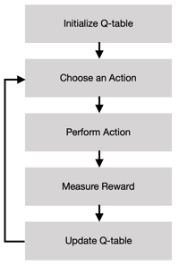
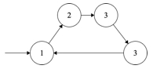
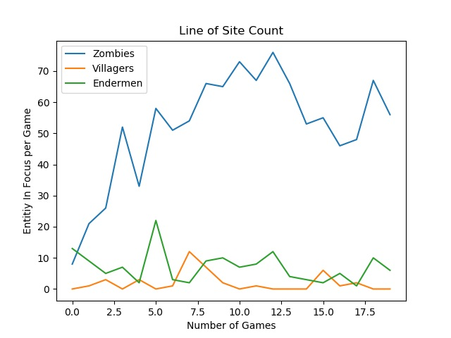
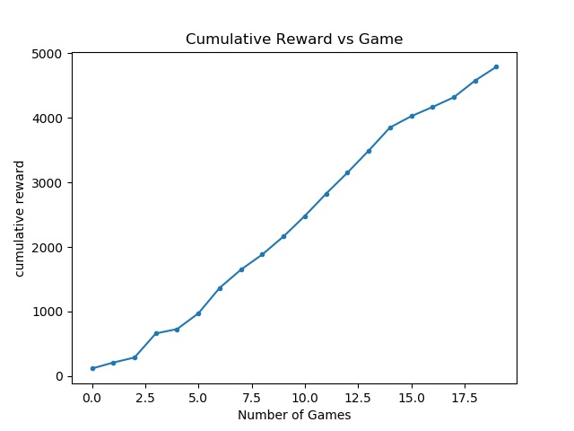
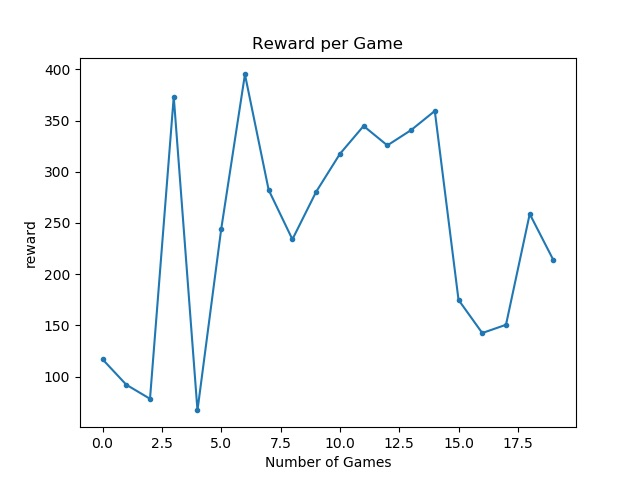
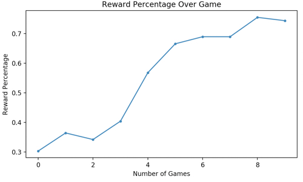

## Video
<iframe width="560" height="315" src="https://www.youtube.com/embed/wmLfU31YlwI" frameborder="0" allow="accelerometer; autoplay; encrypted-media; gyroscope; picture-in-picture" allowfullscreen></iframe>

## Project Summary

The idea of our project is to create a counter siege AI that learns to both demarcate between "enemy" and "good" entities as well as using its knowledge of its weapon inventory to kill as many enemies as possible. The agent will start on one side of a clay barrier and be equipped with a bow (and arrow) and sword. The side of the barrier opposite to the agent will be filled with "enemy" entities, specifically endermen and zombies. Zombies will look for holes in the barrier to rush created by the Endermen who will randomly remove block pieces from the barrier. On the same side of the barrier as the agent will be "good" entities, specifically villagers. The agent should learn not to kill any villagers.
 
While our agent can eventually implicitly differentiate between an enemy and good entity, the focus of the project is to have the agent demonstrate weapon-use intelligence as noted in the first paragraph. When the agent determines which entity should be classified as a threat, it must know how to respond. A sword swing for example, is the much preferred choice when directly in front of an enemy because a sword swipe can damage multiple enemies. A bow is less preferable because it can only strike a single entity at a time. It does become preferable, however, when its target entity is far enough away. These 2 weapon-use ideas (sword and bow) would be tedious, but possible to implement explicitly. However, explicit implementation becomes impractical quickly when adding more weapons. 

[Code Repository](https://github.com/jeffomidvaran/TheBlockouts)

## Approach
 

  
<!-- 
   -->

Our update function is based on the Bellman Equation for Q learning. 
 
$$ \quad Q^\pi(s_t, a_t) = E[R_{t+1} + \gamma R_{t+2} +  \gamma^2 R_{t+3}... + [s_t, a_t]] $$ 

For our project we are implementing a q-tabular reinforcement learning system inspired by assignment_2. The table is implemented as a 2-level python dictionary for states-actions and their assigned reward; any unseen state will be initialized to 0. The update function for the q-table is as follows:

$$ \text{old_q_value} + [\alpha \times (\text{current_reward} + \gamma \times \text{max_q_value_for_state_x} - \text{old_q_value})] $$

<strong>old_q_value</strong> represents the old value our function assigned to the previous state and action
 
<strong>alpha $$\alpha$$</strong> represents the learning rate; how fast our function picks up on and incorporates what it observes
 
<strong>gamma $$\gamma$$</strong> represents the discount factor; how much importance we want to give to future rewards
 
<strong>max_q_value_for_state_x</strong> represents the maximum assigned value for the current state and all possible actions for that state.
 

We have set both our alpha and gamma to 1 as we were satisfied with the performance of our agent with those values. Our agent will choose the best action for the given state (or any of the best actions at random if there are multiple best actions); an action being the best means that it has the highest assigned value for the state. We will, with some probability, epsilon, choose a random action for a state. This is to simulate an exploration of the space and fight against &sol;reach some local maxima of understanding. Our epsilon is set to 0.1 as we are satisfied with the agent's performance with that value. 

<h4> Our states will consist of the following: </h4>

<ul>
    <li>The number of zombies alive (integer). This is useful for the agent to know if there are any enemy targets left. For example, the agent shouldn’t hit a villager so if it was targeting one and knew there were enemies alive, it would learn to switch targets</li>
    <li>What type of entity is in the agent’s line of sight (string). This is so the agent knows what it’s attacking; it will be able to deduce that when facing a villager, it’s a bad idea to attack while when facing a zombie, it’s a good idea</li>
    <li>Is the entity the agent is facing within attacking distance (boolean). Knowing whether a sword swing should go through will be useful to the agent so it will be better informed whether or not it’s worth swinging</li>
</ul>

<h4>Our action states will consist of the following:</h4>
<ul>
    <li>Attacking with the swing of a bow (the agent will move to the entity in line of sight and start swiping at it with a bow)</li>
    <li>Attacking by swinging the sword (the agent will move towards the entity it’s targeting and swing the sword once). The agent will have the ability to attack multiple enemies up close</li>
    <li>Attacking by shooting an arrow (the agent will move to the entity it’s targeting and fire an arrow). The agent will have the ability to attack from a distance in cases where it can’t throw a sword swipe</li>
    <li>Targeting a random entity (the agent will switch focus to an entity in the current line of sight). The agent will have the ability to switch targets if it’s current target is an entity it doesn’t want to attack</li>
    <li>Doing nothing (the agent will wait for the next agent action sequence)</li>
</ul>

<h4> Terminating States: </h4>
<ul>
    <li>Time runs out</li>
    <li>Agent dies</li>
</ul>

<h4>Rewards:</h4>
<ul>
    <li>Dealing damage to a zombie: 10</li>
    <li>Dealing damage to an endermen: 1</li>
    <li>Dealing damage to a villager: -10</li>
    <li>Intent to attack a Zombie: 0.1</li>
    <li>Intent to attack a Enderman: 0.01</li>
    <li>Intent to attack a Villager: -0.1</li>
    <li>Changing targets: -2</li>
</ul>

<h4>Goal:</h4>

Kill as many bad entities as possible (Zombies and Enderman) while leaving Villagers unharmed. Learn to effectively do the most damage in the least amount of time by properly using the sword and bow when optimal. 

<h4>Environment: </h4>

The environment will be set as a box-like cave with a barrier separating the Agent and Villagers from the Zombies and Enderman. Enderman have the ability to remove blocks from the barrier protecting the Agent and Villagers. The Agent will be equipped with a bow and arrow and will have the ability to swipe the bow and fire arrows. The environment will have a set number of Zombies, Endermen, and Villagers. 

<h4>Idea of Approach:</h4>

We want the agent to learn to kill the most enemies it can. We set the reward for Zombies to 10 so the agent is most incentivized to go after them. Endermen are set to 1 because we would prefer that the agent de-prioritize them because they are the most dangerous. It’s not unreasonable for the agent to die after engaging the endermen. We do, however, want the agent to go after the endermen if there are no other enemies left which is why the reward value is positive. We don’t want the agent to attack the villagers under any circumstance so the reward is -10. For all entities, we also reward based on intent. This is so the agent picks up quicker what it should be prioritizing. Without these incentives, the agent might get caught in a loop of doing nothing because at game start, it isn’t able to do any damage or receive an reward. Changing targets is valued at -2 because it takes the agent time to do this; it should only do this when it’s targeting a villager, which has a reward of -10. Switching will be worth it in that case, but a waste of time otherwise. The agent should learn when it’s best to fire an arrow, which is usually when the target is further away when a sword swipe won’t reach. A sword swipe is incentivized when possible though, as it allows the agent to receive much more reward from attacking multiple entities than from an arrow shot which harms a single target.

<h4>Biggest Advantage:</h4>
Our agent’s understanding of the weapons is implicit, this is highly useful if we decide to add more weapons; the reward speaks for itself.

<h4>Biggest Disadvantages:</h4>
Without the reward for intent, the agent would take far longer to understand that it should attack endermen and zombies while leaving villagers alone. A Q-learning implementation restricts the complexity of the agent because it won’t be able to finely tune everything a player can do because of its limited state and action space.

## Evaluation
<h4>Measuring Target Selection</h4>

To evaluate if our agent is able to distinguish between which entities are dangerous and which are best ignored, we kept track of which entities it tended to focus on most during each game, meaning it ensured it stayed facing them and tracked them. As can be seen from the Line of Site Count Graph, the agent very quickly learned that Zombies are a primary target and should be attacked as much as possible. The agent learns villagers pose no threat to it and attacking them is not very helpful, since it only focuses on them a few times in any mission. Endermen are not particularly aggressive despite being an enemy so they should not be a primary focus of the agent, but it should be wary of them. The agent seems to be successful in learning this as it does not focus on Endermen very much, but is still focusing on them more than the villagers.

<h4>Quantifying Combat Strategy</h4>

To see what type of strategy it was developing we kept track of which attacks it tried when trying to fight an entity and how often each attack was used. As we see it very strongly favors firing arrows at enemies, and learns to do so very quickly. It often would try shoot enemies from its spawn point to try and maximize its reward as much as possible. This is a very good strategy since the arrow allows for the agent to attack enemies much faster since it does not need them to get close to it to be able to fight them. The agent would get the most rewards whenever it would successfully hit an enemy and the bias towards long reach and fast engagement is appropriate for our task, especially since the agent is very often attacking from behind the barrier (when sword swipes are often ineffective).  

<h4>Quantifying Combat Effectiveness and Efficiency</h4>

To see if the agent was actually developing an effective strategy we plotted the total reward at the end of each mission. The agent was given +10 for damaging a zombie, +1 for damaging an enderman, -10 for damaging a villager, +.1 for trying to attack a zombie(but not necessarily damaging, +.01 for trying to attack an enderman, and -.1 for trying to attack a villager. As we can see from the graph, the agent does not converge on a particular value. This, however, doesn’t mean that the agent didn’t figure out which entities to target (and attack). It’s possible in some games that it attacked an enderman once and was killed, resulting in low reward. It’s also possible that in some of these games the agent ran out of time before being able to kill all the enemies.

$$ v $$ = number of attacks needed to kill villager * reward for hitting villager 
$$ z $$ = number of attacks needed to kill zombie * reward for hitting zombie 
$$ e $$ = number of attacks needed to kill Endermen * reward for hitting Endermen 

$$ n_v = $$ total number of villagers 
$$ n_z = $$ total number of zombies 
$$ n_e = $$ total number of Endermen 

$$ n_{vk} = $$ total number of villagers killed 
$$ n_{zk} = $$ total number of zombies killed 
$$ n_{ek} = $$ total number of Endermen killed 

$$ \text{successful reward percentage} = P =  \frac{|vn_v| + vn_{vk} + zn_{zk} + en_{ek}} {vn_{v} + zn_{z} + en_{e}} $$ 
  

<h4>Conclusion</h4>

From our combat graphs, we can see that the agent knows it should be fighting zombies more than any other entity. We also see that it learns that the bow is more effective than the sword for damaging the zombies as much as possible given it’s typical situation (behind the wall). The agent clearly has learned what it should be doing and what actions tend to do the most damage. From the rewards graph, we can see that despite seeming to have learned how to fight zombies and that bows are a faster way to hit them usually, the agent was either not always able to kill every enemy or was itself killed by an enderman. While longer runs might lead to a higher average as far as rewards (learning to almost never attack an enderman as well as figure out how to most quickly dispose of enemies), we are satisfied with the performance of our agent.

<!--    

    -->

## Resources Used 
- [Minecraft Wiki](https://minecraft.gamepedia.com/)
- [AI inspiration](https://github.com/Microsoft/malmo-challenge/tree/master/malmopy)
- [tabular_q_learning.py](https://github.com/microsoft/malmo/blob/master/Malmo/samples/Python_examples/tabular_q_learning.py)
- [hit_test.py](https://github.com/microsoft/malmo/blob/master/Malmo/samples/Python_examples/hit_test.py)
- [Microsoft XML Schema documentation](https://microsoft.github.io/malmo/0.30.0/Schemas/MissionHandlers.html)
