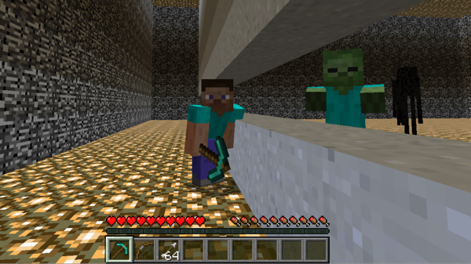

Source code: https://github.com/jeffomidvaran/TheBlockouts

<h1> 
The Blockouts Project Homepage
</h1> 

<h2>Project Information</h2>

The main idea of The Blockouts project is to create a counter siege AI. Counter siege, in this context, means the AI will try to survive as long as possible while trying to preventing enemies from crossing its border. 
The ai will take as input enemy locations, enemy types, the ideal state of its structure, and the current state of the structure. As output the AI will decide between moving, fighting, and placing blocks.

<h2>Reports:</h2>
- [Proposal](https://jeffomidvaran.github.io/TheBlockouts/proposal)
- [Status](https://jeffomidvaran.github.io/TheBlockouts/status)
- [Final](https://jeffomidvaran.github.io/TheBlockouts/final)
- [Team Details](https://jeffomidvaran.github.io/TheBlockouts/team)

<!-- What's Markdown (`.md`)?

Markdown is markup that lets you write hypertext (HTML) documents
in easy-to-read and easy-to-write plain text.
No angle brackets `<></>` required for
paragraphs, lists, blockquotes, tables, etc.

This is a paragraph (in Markdown). Some more
text here.

This is another paragraph.

This is a list:
- Orange
- Apple
- Blueberry

$$x^2 = y^2$$

Just getting started with Markdown?
See the [HTML <-> Markdown Quick Reference (Cheat Sheet)][quickref].

[quickref]: https://github.com/mundimark/quickrefs/blob/master/HTML.md -->
