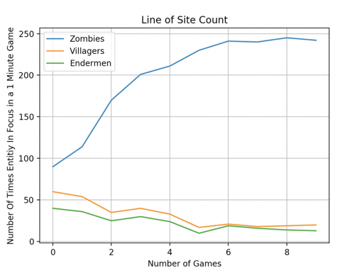

## Project Summary

The basic idea of our project is to create a counter siege AI. Our implementation creates a clay barrier. On one side of the barrier are harmful entities (Zombies and Endermen). Zombies will rush the barrier looking for a hole while Endermen will randomly remove pieces blocks from the barrier. On the other side of barrier resides our Agent and non-harmful entities. The Agent's job will be to learn which entities are harmful and to attack these entities while leaving non-harmful entities alive.
 
[Code Repository](https://github.com/jeffomidvaran/TheBlockouts)

## Video
<iframe width="560" height="315" src="https://www.youtube.com/embed/uEv_zd5c7fE" frameborder="0" allow="accelerometer; autoplay; encrypted-media; gyroscope; picture-in-picture" allowfullscreen></iframe>

## Approach
For our project we are implementing a q-tabular reinforcement learning system inspired by assignment_2. 
  

  
Our update function is based on the Bellman Equation for Q learning. 
 
$$ \quad Q^\pi(s_t, a_t) = E[R_{t+1} + \gamma R_{t+2} +  \gamma^2 R_{t+3}... + [s_t, a_t]] $$ 
<!-- $$ \text{oldQValue} + [\alpha \times (\text{currentReward} + \gamma * \text{maxQValueForStateX} - \text{oldQValue})] $$ -->

<h4> State Space: </h4>
<ul>
    <li>Are there currently any zombies, endermen, or villagers alive (boolean)</li>
    <li>What type of entity is in the agent’s line of sight (entity_dictionary)</li>
</ul>

<h4> Action Space: </h4>
<ul>
    <li>Attacking with the swing of a bow (the agent will move to the entity in line of sight and start swiping at it with a bow)</li>
    <li>Attacking by shooting an arrow (the agent will move to the entity in the line of sight and start shooting arrows)</li>
    <li>Targeting a random entity (the agent will switch focus to an entity in the current line of sight)</li>
    <li>Doing nothing (the agent will wait for the next agent action sequence)</li>
</ul>

<h4> Terminating States: </h4>
<ul>
    <li>Time runs out</li>
    <li>Agent dies</li>
</ul>

<h4>Rewards:</h4>
<ul>
    <li>Dealing damage to a zombie: 10</li>
    <li>Dealing damage to an endermen: 1</li>
    <li>Dealing damage to a villager: -10</li>
</ul>

<h4>Goal:</h4>

Kill as many bad entities as possible (Zombies and Enderman) while leaving Villagers unharmed. 

<h4>Environment: </h4>

The environment will be set as a box-like cave with a barrier separating the Agent and Villagers from the Zombies and Enderman. Enderman have the ability to remove blocks from the barrier protecting the Agent and Villagers. The Agent will be equipped with a bow-and-arrow and will have the ability to swipe the bow and fire arrows. The environment will have a set number of Zombies, Endermen, and Villagers. 

## Evaluation
<h4>Grading Agent's choice of who to attack: </h4>
We take multiple instances of states and resulting actions to see what was in the agent’s line of sight when they chose to attack. We grade the agent on the percentage of times a harmful entity was in the line of sight vs a non-harmful entity. This is to show that the agent learns to prioritize harmful_entities while avoiding non-harmful entities.

   

<h4>Grading Reward: </h4>
The reward metric is a percentage. Where the Agent receives a 100% if all of the harmful entities are killed and all of the non-harmful entities are left unharmed. To calculate this metric, the following formula is applied. 

$$ v $$ = number of attacks needed to kill villager * reward for hitting villager 
$$ z $$ = number of attacks needed to kill zombie * reward for hitting zombie 
$$ e $$ = number of attacks needed to kill Endermen * reward for hitting Endermen 

$$ n_v = $$ total number of villagers 
$$ n_z = $$ total number of zombies 
$$ n_e = $$ total number of Endermen 

$$ n_{vk} = $$ total number of villagers killed 
$$ n_{zk} = $$ total number of zombies killed 
$$ n_{ek} = $$ total number of Endermen killed 

$$ \text{successful reward percentage} = P =  \frac{|vn_v| + vn_{vk} + zn_{zk} + en_{ek}} {vn_{v} + zn_{z} + en_{e}} $$ 

   

   

## Remaining Goal and Challenges
<h4>Remaining Goals</h4>
Our remaining goal for the rest of this quarter will be to improve the effectiveness of our AI. When attacking the Agent does not take into account the distance from the entity that it is attacking. For the final implementation we would like explore the efficacy of shooting an arrow vs swinging the bow based on an entities distance from the Agent. 

 
Currently, our Agent does not fully account for the unique behavior of Endermen. Endermen are the only harmful entities in our environment that can alter the barrier (Endermen will randomly pick up blocks from the barrier and move them). They do not attack an Agent unless they are attacked first or if an Agent makes eye contact with an Endermen. Once an Endermen is attacked or makes eye contact with the Agent, it becomes far more dangerous than a Zombie. For the final implementation, we plan to explore effective ways for the Agent to learn to deal with the unique behavior of Endermen. 
 
In our current implementation we are using a set number of entities but we would like to explore the effectiveness of our agent when the number of entities varies. The Agents goal regarding which harmful entity to attack and which type of attack to use may change in these scenarios. 
 
<h4>Challenges</h4>
In the next few weeks we anticipate having several challenges. First will be ensuring the accuracy of our evaluation cases. Some metrics are simple and arguably represent what our agent is trying to accomplish, but others may not be. Secondly our agent may behave unexpectedly as the state space and action space grow (especially given the unpredictable actions of Endermen). To combat these issue we plan to do more extensive testing, reinforcement learning and potentially develop new logistical tests that will reveal the efficacy our Q-learning system.

## Resources Used 
- [Minecraft Wiki](https://minecraft.gamepedia.com/)
- [AI inspiration](https://github.com/Microsoft/malmo-challenge/tree/master/malmopy)
- [tabular_q_learning.py](https://github.com/microsoft/malmo/blob/master/Malmo/samples/Python_examples/tabular_q_learning.py)
- [hit_test.py](https://github.com/microsoft/malmo/blob/master/Malmo/samples/Python_examples/hit_test.py)
- [Microsoft XML Schema documentation](https://microsoft.github.io/malmo/0.30.0/Schemas/MissionHandlers.html)

 